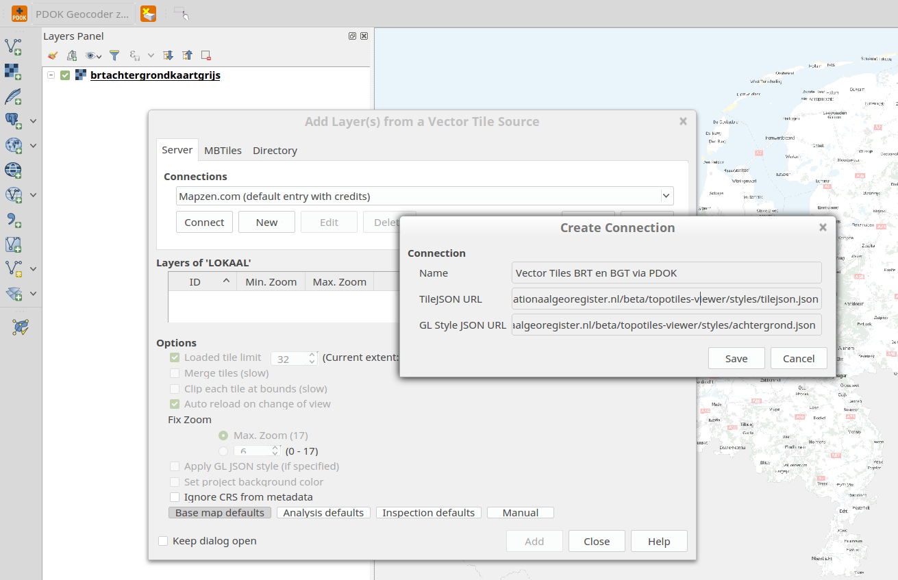
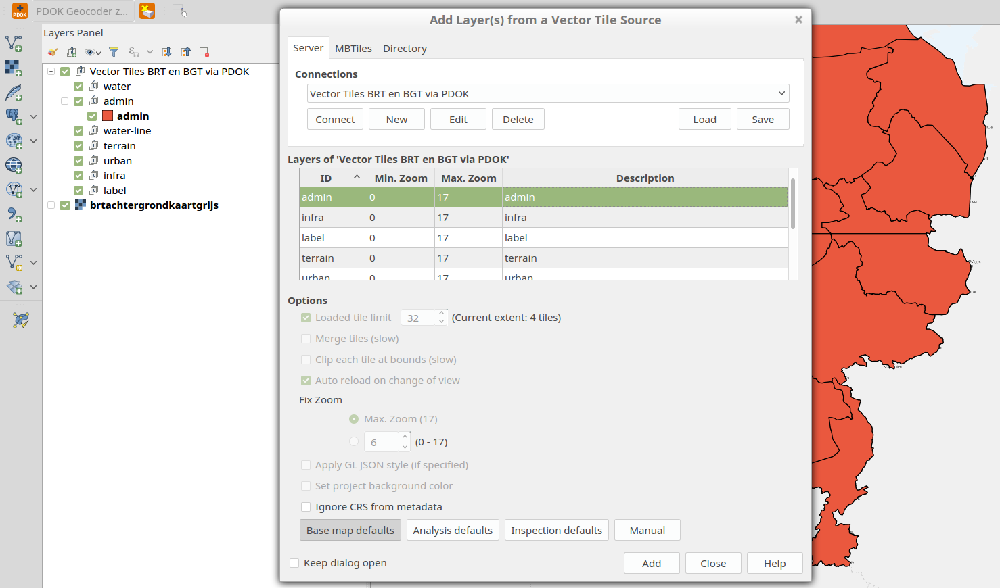
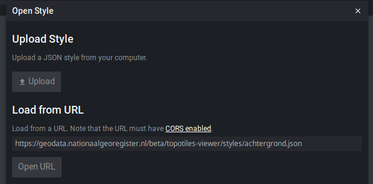
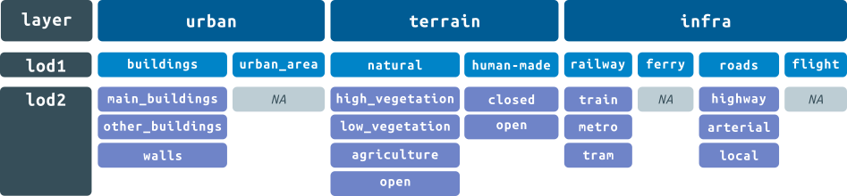
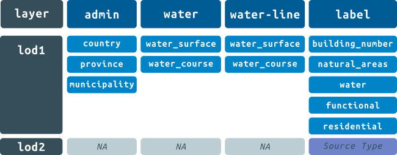

Vector Tiles: BRT and BGT
=========

Introduction
------------

This project brings together features from across both BGT and BGT into a single data model. The consistent hierarchy of feature types aims to simplify making interactive maps using Dutch open data. Instead of having to remember what one particular road class is called in the different datasets, you can simply refer to 'roads' and the  features from the most appropriate dataset will be targeted at each zoom level.

Furthermore, the project aims to reduce the workload on the server-side whilst increasing cartographic design flexibility. This is accomplished using vector tile technology with opinionated choices about what features to serve at what zoom level.

Contents
--------

* [Beta](#beta)
* [Demo](#demo)
* [End-points](#end-points)
* [How to use](#how-to-use)
* [Styling](#styling)
* [Data structure](#data-structure)
	* [Attributes](#attributes)
* [Source Data](#source-data)
	* [Source Data per zoom level](#source-data-per-zoom-level)
	* [Source Data per layer](#source-data-per-layer)


Beta
-------------

This is a beta release. These vector tiles have been generated once for evaluation purposes. E.g. tiles derived from BGT are not updated daily. Please provide feedback using the GitHub [issue system](https://github.com/PDOK/vectortiles-bgt-brt/issues) or post a message on the [PDOK forum](https://forum.pdok.nl/c/datasets/vector-tiles-brt-en-bgt).

Demo
-------------

A demo viewer is available at http://geodata.nationaalgeoregister.nl/beta/topotiles-viewer/


End-points
-------------

* [TileJSON](https://github.com/mapbox/tilejson-spec) endpoint:

`https://geodata.nationaalgeoregister.nl/beta/topotiles-viewer/styles/tilejson.json`

* Raw tile endpoint:

`http://geodata.nationaalgeoregister.nl/beta/topotiles/{z}/{x}/{y}.pbf`

* [StyleJSON](https://www.mapbox.com/mapbox-gl-js/style-spec/) for the BRT-Achtergrondkaart default style: 

`https://geodata.nationaalgeoregister.nl/beta/topotiles-viewer/styles/achtergrond.json`

* Metadata endpoint: 

`http://geodata.nationaalgeoregister.nl/beta/topotiles/metadata.json`

How to use?
-------------

YOu can render vector tiles using various JavaScript libraries or desktop GIS. For example:

### Mapbox-GL.js
[Mapox-GL.js](https://www.mapbox.com/mapbox-gl-js/api/) is a JavaScript library that uses WebGL to render vector tiles.

The `achtergrond.json` meets the [Mapbox GL Style Spec](https://www.mapbox.com/mapbox-gl-js/style-spec).

To set up a map with the PDOK vector tiles and `achtergrond.json` you just need to refer to `style: 'https://geodata.nationaalgeoregister.nl/beta/topotiles-viewer/styles/achtergrond.json'`


```js
var map = new mapboxgl.Map({
    container: 'map-container',
    style: 'https://geodata.nationaalgeoregister.nl/beta/topotiles-viewer/styles/achtergrond.json',
    zoom: 11,
    center: [ 4.8, 52.4]
});
```

Have a look at this [simple working example](https://github.com/PDOK/vectortiles-bgt-brt/blob/master/examples/mapbox_map.html).

### QGIS 2.18

Also QGIS 2.18 supports vector tiles. To view the vector tiles in QGIS you can install the [Vector-Tiles-Reader-QGIS-Plugin](https://github.com/geometalab/Vector-Tiles-Reader-QGIS-Plugin) by Martin Boos.

0. Before adding the Vector Tiles, you must centre your map view on the Netherlands. Otherwise there will be no tile requests. 
1. `Add Vector Tile Layer`
2. Create a new connection, using the `tilejson.json` and `achtergrond.json` endpoints:



3. Connect and add the desired layers




Styling
----------------------
There are already some styles available for you:

* BRT-achtergrondkaart default: https://geodata.nationaalgeoregister.nl/beta/topotiles-viewer/styles/achtergrond.json
* Outlines: https://geodata.nationaalgeoregister.nl/beta/topotiles-viewer/styles/data.json
* Funny pink: https://geodata.nationaalgeoregister.nl/beta/topotiles-viewer/styles/purple.json
* Minimalistic: https://geodata.nationaalgeoregister.nl/beta/topotiles-viewer/styles/roads.json

Feel free to use, copy and edit them. These styles conform to the [Mapbox GL Style Spec](https://www.mapbox.com/mapbox-gl-js/style-spec).

### Maputnik

Use an online editor like [Maputnik](https://maputnik.github.io/) to create a style or write one yourself in `json` format. [Maputnik](https://maputnik.github.io/) is a free visual style editor for maps targeted at developers and designers. 

Got to https://maputnik.github.io/editor/

1. Click `Open`
2. Load from URL



3. Edit your style
4. Export your style and save it to use in other applications

Data structure
--------------

In order to create a detailed style it is important to know which data is available in the tiles.

There are 7 layers:

layer | description | feature type
----- | ----------- | ------------
admin | administrative boundaries | POLYGON
water | water areas | POLYGON
water-line | waterways | LINE
terrain | land-use areas (natural and human-made) | POLYGON
urban | built-up areas, buildings | POLYGON
infra | roads, railways, ferries | LINE
label | names of features | POINT

### Attributes

Each layers contains (as much as possible) the following attributes:

- `lod1`
- `z_index`
- `original_id`
- `lod2` (not all layers)
- `lod3` (not all layers)
- `name` (not all layers)

### z-index

The attribute `z-index` is the [relatieve hoogte ligging](http://imgeo.geostandaarden.nl/def/imgeo-object/overbruggingsdeel/inwinningsregel-imgeo/toelichting-relatieve-hoogte). If none was provided it is set to 0. 

### name

The objects given name from the source data, if available. If not available, the field is empty. Frequently, the source data contains multiple names. Only one name is included in the vector tiles.

Name priority for urban areas:

	COALESCE(s.naamofficieel, s.naamfries, s.naamnl)

Name priority for infrastructure:

	 COALESCE(
            NULLIF(s.naam, ''),
            NULLIF(s.straatnaamfries, ''),
            NULLIF(s.straatnaamnl, ''),
            NULLIF(s.brugnaam, ''),
            NULLIF(s.tunnelnaam, ''),
            NULLIF(s.knooppuntnaam, ''),
            NULLIF(s.awegnummer, ''),
            NULLIF(s.nwegnummer, ''),
            NULLIF(s.swegnummer, ''),
            NULLIF(s.afritnaam, ''),
            NULLIF(s.afritnummer, ''),
            '')

This means the `naamofficieel` is used when available, if there is no `naamofficeel` it takes the `naamfries`. If that is not there it takes the `naamnl`, if all not existing the field stays empty. 

### original_id

Each feature has an attribute `original_id` which is a string consisting of an identifier for the source dataset and the original ID in the source dataset. It is built up as follows: `NL.<SOURCE_DATASET>.<ORIGINAL_ID>`. There is also an attribute `original_source` which contains the name of the original source.

### Level Of Detail (lod)

Features within these layers have attributes `lod1` and `lod2` (and sometimes `lod3`) which can be used to select subsets. For example, the `infra` layer contains roads, railways, tram and metro lines, and ferries. To select only roads, you can filter on `lod1 = roads`. To further select a particular type of road, you can use `lod2`, for example, `lod2 = arterial`.

The full list of sub-classifications per layer: 



<!-- 
##### admin LOD1
* country
* province
* municipality

##### water LOD1
* water_surface
* water_course

##### water-line  LOD1
* water_surface
* water_course

##### terrain LOD1
* natural
* human-made

##### terrain LOD2 & (LOD1 = natural)
* high_vegetation
* low_vegetation
* agriculture
* open

##### terrain LOD2 & (LOD1 = human-made)
* closed
* open

##### urban LOD1
* buildings
* urban_area

##### urban LOD2 
* main_building
* other_buildings
* walls

##### infra LOD1
* railway
* roads
* ferry
* flight

##### infra LOD2 &(LOD1=railway)
* train
* metro
* tram

##### infra LOD2 &(LOD1=roads)
* highway
* arterial
* local -->

Source Data
------------
The data has been derived from the authentic registrations the [Basisregistratie Topografie](https://www.kadaster.nl/brt) (BRT) and the [Basisregistratie Grootschalige Topografie](https://www.kadaster.nl/bgt) (BGT). A lot of modification have been made to the attribute information. The geometries have been kept as-is. Multi-geometries have been changed into single geometries since the vector tile spec does not supprt multi-geometries. Furthermore, the data has been reprojected from Amersfoort New to Web Mercator projection.

## Source data per zoom level

**Data sources per zoom level**

zoom level | source
----------|--------
0-5| TOP1000
6-7 | TOP500
8-9 | TOP250
10-11 | TOP100
12-13 | TOP50
14-15 | TOP10
16-17 | admin: TOP10<br>all other layers: BGT

Some exceptions:

- The administrative areas of the TOP10NL are also used on zoom level 16-17, because the BGT did not contain these polygon areas. 
- The residential labels are not chosen on dataset per zoom level, but a hierarchical distinction is made on population size and importance. For example, on zoom 0-5 only the label Amsterdam is available. The zoom level 6-7 contains large residential areas and province capitals. At zoom 8-9 the residential areas with population size larger then 100.000 are included etc.
- At lower zoom levels not all infrastructure data is available (although it exists in the source datasets). The `arterial` and `local` roads are only visible from zoom level 10 and higher. The local roads are rarely used on the lower zoom levels and this decreases the data size of the tiles.

## Source data per layer

### admin

geometry type = `POLYGON`

**Includes:**
- top10nl.registratiefgebied
- top50nl.registratiefgebied
- top100nl.registratiefgebied
- top250nl.registratiefgebied
- top500nl.registratiefgebied
- top1000nl.registratiefgebied

**Not available in tiles:**
- territoriale zee
- enclave

### water

geometry type = `POLYGON`

**Includes:**
- bgt.waterdeel
- top10nl.waterdeel
- top50nl.waterdeel_vlak
- top100nl.waterdeel_vlak
- top250nl.waterdeel_vlak
- top500nl.waterdeel_vlak
- top1000nl.waterdeel_vlak

**Not included in this layer:**
- bgt.OndersteunendWaterdeel -> in `terrain`


### water-ways

geometry type = `LINESTRING`

**Includes:**
- top10nl.waterdeel
- top50nl.waterdeel_lijn
- top100nl.waterdeel_lijn
- top250nl.waterdeel_lijn
- top500nl.waterdeel_lijn
- top1000nl.waterdeel_lijn

**Not included in this layer:**
- Nothing from BGT

### infra

geometry type = `LINESTRING`

**Includes:**
- bgt.spoor
- top10nl.wegdeel
- top10nl.spoorbaandeel
- top50nl.wegdeel_lijn
- top50nl.spoorbaandeel_lijn
- top100nl.wegdeel_lijn
- top100nl.spoorbaandeel_lijn
- top250nl.wegdeel_lijn
- top250nl.spoorbaandeel_lijn
- top500nl.wegdeel_lijn
- top500nl.spoorbaandeel_lijn
- top1000nl.wegdeel_lijn
- top1000nl.spoorbaandeel_lijn

**Not available in tiles:**
- parkeerplaats
- parkeerplaats: carpool
- parkeerplaats: P+R

### urban

geometry type = `POLYGON`

**Includes:**
- bgt.pand
- bgt.OverigBouwwerk
- bgt.Kunstwerkdeel
- bgt.GebouwInstallatie
- bgt.OverigeScheiding
- bgt.Scheiding
- top10nl.gebouw
- top50nl.gebouw_vlak
- top50nl.terrein_vlak `typelandgebruik = 'bebouwd gebied'`
- top100nl.gebouw_vlak
- top100nl.terrein_vlak `typelandgebruik = 'bebouwd gebied'`
- top250nl.plaats_vlak
- top500nl.plaats_vlak
- top1000nl.plaats_vlak


**Not available in tiles:**
- top10nl.terrein `typelandgebruik = 'bebouwd gebied'`


### terrain

geometry type = `POLYGON`

**Includes:**
- bgt.BegroeidTerreindeel
- bgt.OnbegroeidTerreindeel
- bgt.OndersteunendWaterdeel
- bgt.OndersteunendWegdeel
- bgt.Overbruggingsdeel
- bgt.Wegdeel

- top10nl.terrein
- top10nl.wegdeel `typeweg = 'parkeerplaats, carpool, P+R, rolbaal, platfrom, startbaan, landingsbaan'`

- top50nl.terrein_vlak
- top50nl.wegdeel_vlak `typeweg = 'parkeerplaats, carpool, P+R, rolbaal, platfrom, startbaan, landingsbaan'`

- top100nl.terrein_vlak
- top250nl.terrein_vlak
- top500nl.terrein_vlak
- top1000nl.terrein_vlak

**Not included in this layer:**
- top50nl.terrein `typelandgebruik = 'bebouwd gebied'`
- top100nl.terrein `typelandgebruik = 'bebouwd gebied'`

**Not available in tiles:**
- top10nl.terrein `typelandgebruik = 'bebouwd gebied'`

### label

geometry type = `POINT`

**Includes:**
- bgt.Pand$nummeraanduidingreeks$positie
- bgt.OpenbareRuimteLabel$positie

- top10nl.geografischgebied
- top10nl.functioneelgebied
- top50nl.functioneelgebied_punt
- top100nl.functioneelgebied_punt
- top250nl.functioneelgebied_punt
- top250nl.geografischgebied_punt
- top500nl.functioneelgebied_punt
- top500nl.geografischgebied_punt
- top1000nl.functioneelgebied_punt
- top1000nl.geografischgebied_punt

TOP100NL: doesn't contain "plaats" or "geografisch gebied"

Residential labels:

- top10nl.plaats `POINTS`
- top10nl.plaats `POLYGONS PointOnSurface` 
- top500nl.plaats_punt
- top1000nl.plaats_punt
- top500nl.plaats_vlak `POLYGONS PointOnSurface` 
- top1000nl.plaats_vlak `POLYGONS PointOnSurface`
